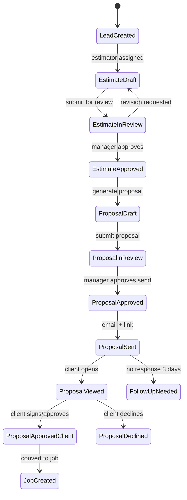

# SmoothOS Estimator, Proposal & Revenue System
## Smooth Construction Services — Boston, MA

**Version:** 1.0  
**Module codename:** `smooth-estimate`  
**Parent platform:** SmoothOS (future CRM, scheduling, jobs, documents)

---

## 1. System Overview

### Purpose

SmoothOS Estimate is the revenue engine for Smooth Construction Services. It replaces spreadsheet estimating with a formula-driven pricing engine, enforces margin guardrails before proposals leave the building, auto-generates branded PDF proposals from approved estimate data, and feeds live operational dashboards from lead intake through booked revenue.

### Users & Roles

| Role | Permissions |
|------|-------------|
| **Admin** | Edit all rate tables, margin profiles, overhead profiles, terms templates, user management |
| **Manager** | Approve/reject estimates & proposals, override margin locks (with reason), view all dashboards |
| **Estimator** | Create/edit estimates, submit for review, cannot send proposals without approval |
| **Sales** | Create leads, view pipeline, request estimates, send approved proposals |
| **Office** | Lead intake, document upload, view client-facing status (read-only pricing internals) |

### Architecture (Implementation Target)

```
┌─────────────────────────────────────────────────────────────────┐
│                     SmoothOS Web App (Next.js)                     │
│  Estimator │ Proposal Review │ Dashboard │ Lead Detail │ Admin    │
└────────────┬────────────────────┬───────────────────┬───────────┘
             │                    │                   │
     ┌───────▼────────┐   ┌───────▼────────┐  ┌──────▼──────┐
     │ Pricing Engine │   │ Proposal Svc   │  │ Analytics   │
     │ (formula core) │   │ PDF + AI text  │  │ Aggregator  │
     └───────┬────────┘   └───────┬────────┘  └──────┬──────┘
             │                    │                   │
     ┌───────▼────────────────────▼───────────────────▼──────────┐
     │              PostgreSQL (primary datastore)                │
     │  leads │ estimates │ line_items │ proposals │ rate_tables  │
     └───────┬───────────────────────────────────────────────────┘
             │
     ┌───────▼────────┐   ┌──────────────┐   ┌─────────────────┐
     │ CRM Webhooks   │   │ S3 / R2 PDF  │   │ Email (Resend)  │
     │ HubSpot/GHL/   │   │ storage      │   │ proposal send   │
     │ Zoho/Airtable  │   │              │   │                 │
     └────────────────┘   └──────────────┘   └─────────────────┘
```

### Core Principles

1. **Price = formulas + editable rate tables.** AI never sets dollars.
2. **Every dollar is decomposed:** material → labor → equipment → direct → overhead → markup → sell.
3. **Manager gate** on proposals when margin is yellow/red or job value exceeds threshold.
4. **Immutable proposal versions** once sent; revisions create new version linked to estimate revision.
5. **Event-sourced activity log** for CRM sync and dashboard freshness.
6. **Service-specific calculators** share a common line-item output schema.

### Default Rate Table Philosophy (Boston Metro, 2025 baseline)

All defaults are **editable** in Admin → Rate Tables. Values below are starting assumptions for implementation seed data—not locked pricing.

| Category | Default assumption |
|----------|------------------|
| Labor burdened rate (installer) | $68/hr |
| Labor burdened rate (lead/supervisor) | $92/hr |
| Company overhead % on direct cost | 18% (editable per overhead profile) |
| Target gross margin | 35% (editable per estimate) |
| Minimum job charge | $850 |
| Mobilization (single crew, local) | $350 |
| Closed-cell material | $1.45/BF |
| Open-cell material | $0.62/BF |
| Blow-in cellulose material | $0.42/SF @ R-49 depth equivalent |
| Drywall hang+finish Level 4 | $2.85/SF |

---

## 2. Estimator Pricing Engine

### A. Estimate Input System

#### Header / Client Block

| Field | Type | Required | Purpose |
|-------|------|----------|---------|
| `client_id` | UUID | Yes (or inline new client) | CRM link |
| `client_name` | string | Yes | Display + proposal |
| `client_email` | email | Yes for proposal send | |
| `client_phone` | phone | Yes | |
| `billing_address` | address object | No | |
| `project_address` | address object | Yes | Job site; drives travel/mobilization |
| `project_city` | string | Yes | Dashboard filter (town) |
| `project_state` | string | Default `MA` | |
| `project_zip` | string | Yes | |
| `lead_id` | UUID | Yes | Pipeline tracking |
| `lead_source` | enum | Yes | Marketing attribution |
| `service_type` | enum | Yes | Primary service category |
| `project_type` | enum | Yes | `residential` \| `multifamily` \| `commercial` \| `municipal` |
| `estimate_name` | string | Yes | e.g. "123 Oak St — Attic Insulation" |
| `margin_target_pct` | decimal | Yes | Default from margin profile |
| `overhead_profile_id` | UUID | Yes | Overhead allocation rules |
| `margin_profile_id` | UUID | Yes | Threshold rules |
| `access_difficulty` | enum | Yes | `standard` \| `moderate` \| `difficult` \| `extreme` |
| `job_condition` | enum[] | No | `occupied` \| `new_construction` \| `remediation` \| `winter` \| `hazmat_adjacent` |
| `is_rush` | boolean | Default false | Applies rush multiplier |
| `is_repeat_layout` | boolean | Default false | Multifamily repeat-unit discount |
| `notes_internal` | text | No | Never on client proposal |
| `notes_client` | text | No | May appear on proposal |
| `valid_until` | date | Yes | Default +30 days from creation |

#### Line Item Block (per assembly)

| Field | Type | Required | Purpose |
|-------|------|----------|---------|
| `line_item_id` | UUID | Auto | |
| `service_code` | enum | Yes | See service catalog |
| `assembly_name` | string | Yes | e.g. "Attic floor — blow-in cellulose" |
| `area_name` | string | No | Room/zone label |
| `quantity_type` | enum | Yes | `sq_ft` \| `board_ft` \| `linear_ft` \| `each` \| `cubic_ft` \| `bag` |
| `quantity_amount` | decimal | Yes | Raw measured quantity |
| `thickness_inches` | decimal | Conditional | Required for foam, blow-in depth |
| `r_value_target` | integer | Conditional | Attic/basement when specified by program |
| `product_id` | UUID | Yes | Links to product rate table |
| `waste_pct` | decimal | Yes | Default from product; editable with reason |
| `production_rate_id` | UUID | Yes | Labor hours driver |
| `labor_rate_id` | UUID | Yes | $/hr for this trade |
| `equipment_id` | UUID | No | Spray rig, lift, blower rental |
| `modifier_ids` | UUID[] | No | Applied multipliers |
| `sort_order` | integer | Yes | Proposal display order |

#### Quantity Type by Service

| Service | Primary quantity_type | Secondary |
|---------|----------------------|-----------|
| Closed/open cell foam | `board_ft` or `sq_ft` + thickness | |
| Attic/basement/crawl insulation | `sq_ft` | `bag` for material reconciliation |
| Blow-in | `sq_ft` + depth | |
| Air sealing | `linear_ft` + `each` (penetrations) | |
| Drywall | `sq_ft` | |
| Plastering | `sq_ft` | |
| Window replacement | `each` | size tier drives product |

### B. Rate Tables

#### Products (`products`)

| Field | Example | Purpose |
|-------|---------|---------|
| `sku` | `CC-SF-2.0` | Internal SKU |
| `name` | Closed Cell 2.0 lb Spray Foam | |
| `service_code` | `closed_cell_foam` | |
| `unit` | `board_ft` | Pricing unit |
| `unit_cost` | 1.45 | Material $/unit |
| `coverage_per_unit` | null | For bag-based products |
| `default_waste_pct` | 0.08 | 8% overspray/waste |
| `manufacturer` | Demilec / Huntsman etc. | Proposal "included materials" |
| `spec_sheet_url` | URL | Optional attachment |
| `active` | true | |

#### Labor Rates (`labor_rates`)

| Field | Example |
|-------|---------|
| `trade_code` | `insulation_installer` |
| `burdened_rate_hr` | 68.00 |
| `effective_date` | 2025-01-01 |
| `region` | `boston_metro` |

#### Production Rates (`production_rates`)

| Field | Example |
|-------|---------|
| `service_code` | `closed_cell_foam` |
| `unit` | `board_ft` |
| `units_per_hour` | 120 | BF/hr per 2-person crew |
| `crew_size` | 2 |
| `conditions` | `standard_access` |
| `notes` | Based on 2" lift average |

#### Waste Rates (`waste_rates`)

Overrides product default by application context.

| Context | Default waste % |
|---------|----------------|
| Closed cell walls | 8% |
| Open cell attic roofline | 10% |
| Blow-in open attic | 5% |
| Drywall new construction | 12% |
| Drywall remodel | 15% |

#### Equipment / Mobilization (`equipment_rates`)

| Code | Charge type | Default |
|------|-------------|---------|
| `SPRAY_RIG_DAY` | per_day | $450 |
| `BLOWER_DAY` | per_day | $175 |
| `LIFT_DAY` | per_day | $325 |
| `MOB_LOCAL` | flat | $350 |
| `MOB_EXTENDED` | flat | $650 (>25 mi from Boston shop) |

#### Markup / Margin Rules (`margin_profiles`)

| Field | Purpose |
|-------|---------|
| `green_min_pct` | ≥35% GM → green |
| `yellow_min_pct` | 28–34.9% → yellow, manager review |
| `red_min_pct` | <28% → red, approval lock |
| `min_job_charge` | $850 |
| `small_job_threshold` | $1,200 sell → small job fee applies |
| `small_job_fee` | $150 |
| `rush_multiplier` | 1.15 |
| `access_multipliers` | JSON: standard=1.0, moderate=1.10, difficult=1.25, extreme=1.45 |
| `repeat_layout_discount_pct` | 12% on labor for qualifying multifamily units |

#### Overhead Profiles (`overhead_profiles`)

| Field | Example |
|-------|---------|
| `name` | Boston Standard 2025 |
| `overhead_pct` | 0.18 | Applied to direct cost |
| `or_fixed_per_job` | null | Alternative model |

### C. Formula Engine (Universal)

All line items compute through this pipeline. Variables are per line unless noted.

```
INPUTS:
  Q_raw        = quantity_amount
  T            = thickness_inches (if applicable)
  waste_pct    = waste rate (0.08 = 8%)
  unit_cost    = product.unit_cost
  units_per_hr = production_rate.units_per_hour
  labor_hr     = labor_rate.burdened_rate_hr
  equip_cost   = allocated equipment for line (see service rules)
  access_mult  = margin_profile.access_multipliers[access_difficulty]
  rush_mult    = is_rush ? margin_profile.rush_multiplier : 1.0
  repeat_disc  = is_repeat_layout ? margin_profile.repeat_layout_discount_pct : 0

STEP 1 — Normalized quantity (Q)
  IF quantity_type = 'sq_ft' AND service uses board feet:
    Q = Q_raw × (T / 12)
  ELSE:
    Q = Q_raw

STEP 2 — Waste-adjusted material quantity
  Q_waste = Q × (1 + waste_pct)

STEP 3 — Material cost
  material_cost = Q_waste × unit_cost

STEP 4 — Labor hours
  labor_hours = (Q / units_per_hr) × access_mult × rush_mult
  IF is_repeat_layout AND service in REPEAT_ELIGIBLE:
    labor_hours = labor_hours × (1 - repeat_disc)

STEP 5 — Labor cost
  labor_cost = labor_hours × labor_hr

STEP 6 — Equipment cost (line allocation)
  equipment_cost = per service equipment rules (see Section 3)

STEP 7 — Line direct cost
  line_direct = material_cost + labor_cost + equipment_cost

STEP 8 — Apply line modifiers (from modifier table)
  line_direct = line_direct × Π(modifier.multiplier)

ESTIMATE ROLLUP:
  direct_cost_total = Σ(line_direct) + mobilization + small_job_fee (if applicable)

  overhead_cost = direct_cost_total × overhead_profile.overhead_pct

  cost_before_profit = direct_cost_total + overhead_cost

  METHOD A — Target gross margin pricing:
    sell_price = cost_before_profit / (1 - margin_target_pct)

  METHOD B — Markup on cost (if profile uses markup):
    sell_price = cost_before_profit × (1 + markup_pct)

  Default: METHOD A

STEP 9 — Gross margin verification
  gross_margin_pct = (sell_price - cost_before_profit) / sell_price

STEP 10 — Minimum job charge
  IF sell_price < margin_profile.min_job_charge:
    sell_price = margin_profile.min_job_charge
    recalculate gross_margin_pct (flag as min-job-adjusted)

STEP 11 — Rounded sell price
  rounded_price = CEILING(sell_price / rounding_increment) × rounding_increment
  Default rounding_increment = $5

OUTPUT (per line, internal):
  Q, Q_waste, material_cost, labor_hours, labor_cost, equipment_cost,
  line_direct, modifiers_applied[]

OUTPUT (estimate level):
  direct_cost_total, overhead_cost, cost_before_profit, sell_price,
  rounded_price, gross_margin_pct, margin_status, alerts[]
```

### D. Service-Specific Pricing Logic

See `03-estimator-formulas.md` for implementation-ready calculation rules per service.

Summary catalog:

| service_code | Display name |
|--------------|--------------|
| `closed_cell_foam` | Closed Cell Spray Foam |
| `open_cell_foam` | Open Cell Spray Foam |
| `attic_insulation` | Attic Insulation |
| `basement_insulation` | Basement Insulation |
| `crawl_space_insulation` | Crawl Space Insulation |
| `blow_in_insulation` | Blow-In Cellulose / Fiberglass |
| `air_sealing` | Air Sealing |
| `drywall` | Drywall Installation |
| `plastering` | Plastering |
| `window_replacement` | Window Replacement |

### E. Margin Controls

| Control | Rule |
|---------|------|
| **Green** | `gross_margin_pct >= green_min_pct` → estimator may submit; manager optional |
| **Yellow** | `yellow_min_pct <= gm < green_min_pct` → requires manager approval before proposal |
| **Red** | `gm < yellow_min_pct` → hard lock; manager override with logged reason only |
| **Low-margin alert** | Dashboard + in-app toast when estimate saved in yellow/red |
| **Min job charge** | Enforced at rollup; shows badge "Minimum job charge applied" |
| **Mobilization** | Auto-added once per estimate if `direct_cost_total > 0`; local vs extended by zip distance |
| **Access multiplier** | Applied to labor hours (not material) unless modifier profile says otherwise |
| **Rush multiplier** | 1.15× labor hours + optional 5% material rush surcharge (configurable) |
| **Small job fee** | If `rounded_price < small_job_threshold` add `small_job_fee` to direct cost before overhead |
| **Repeat-layout discount** | Multifamily + `is_repeat_layout`: labor hours × (1 - discount); min 4 identical units to qualify |

**High-value gate:** Estimates with `rounded_price >= $25,000` require manager approval regardless of margin color.

### F. Estimate Outputs

#### Admin / Internal Estimate View

**Visible:** All line internals, unit costs, labor hours, overhead %, cost_before_profit, gross margin %, margin status, waste %, production rates used, modifiers, mobilization, small job fee, estimator notes, revision history, approval log.

**Hidden from client:** Everything except assemblies described in client view.

#### Client-Facing Estimate / Proposal View

**Visible:** Client name, project address, scope narrative (AI-assisted), line item descriptions (no unit costs), grouped assemblies, total price (rounded), deposit amount, validity date, schedule window, terms, approval CTA.

**Never visible:** unit_cost, labor_hours, overhead_pct, gross_margin_pct, internal notes, production rates, waste %.

---

## 3. Service-Specific Pricing Logic

Detailed formulas: `docs/smoothos/03-estimator-formulas.md`

Each service defines: required inputs, formula structure, production logic, modifiers, example line item JSON.

---

## 4. Margin Controls and Guardrails

Covered in Section 2E. Implementation notes:

- `margin_status` computed on every save: `green` | `yellow` | `red` | `min_job_adjusted`
- `approval_required` boolean = true if yellow/red OR high_value OR manual flag
- `can_send_proposal` = estimate.status = `approved` AND proposal.status in (`draft`, `revision_needed`)
- Override table `margin_overrides`: user_id, reason, timestamp, old_gm, new_gm

---

## 5. Estimate Outputs

### Workflow States — Estimate

```
draft → in_review → approved | revision_requested → (edit) → in_review
approved → superseded (when new revision approved)
```

### Export Artifacts

| Artifact | Trigger | Format |
|----------|---------|--------|
| Internal cost sheet | Manager | PDF/XLSX |
| Client proposal | Approved + generate | PDF |
| Estimate summary | CRM webhook | JSON |

---

## 6. Auto Proposal Generator

### A. Workflow



| Step | System action | CRM sync event |
|------|---------------|----------------|
| Lead created | Create lead, alert sales | `lead.created` |
| Estimate built | Link estimate to lead, stage → estimate in progress | `estimate.created` |
| Manager review | Lock pricing fields if in review | `estimate.submitted` |
| Proposal approved internally | Enable PDF generation | `proposal.internal_approved` |
| PDF generated | Store to S3, version immutable | `proposal.generated` |
| Emailed | Track sent_date, unique view token | `proposal.sent` |
| Client views | Log viewed_date, IP optional | `proposal.viewed` |
| Client approves | Capture signature, deposit calc | `proposal.approved` |
| Declines | Capture reason | `proposal.declined` |
| Job created | Push to jobs module placeholder | `job.created` |

### B. Proposal Document Structure

1. **Cover / Header** — Smooth logo, orange accent bar, proposal #, date, validity
2. **Client block** — Name, address, phone, email, project address
3. **Project summary** — AI-written 2–3 sentences from estimate metadata (no invented scope)
4. **Scope of work** — Per line item assemblies; AI expands descriptions from structured inputs only
5. **Included materials / systems** — Product names from `products` table
6. **Assumptions & exclusions** — Template + AI fill from `job_condition`, `access_difficulty`
7. **Price summary** — Single total or optional grouped subtotals (no unit pricing)
8. **Schedule** — Estimated start window, duration in days, site readiness requirements
9. **Terms & conditions** — See Section 6F
10. **Approval section** — E-sign or click approve, deposit line, date

### C. PDF Design — Smooth Brand

| Element | Spec |
|---------|------|
| Primary orange | `#F26522` |
| Black | `#1A1A1A` |
| White background | `#FFFFFF` |
| Body font | Inter or Source Sans 10–11pt |
| Headings | 18/14/12pt bold, black |
| Accent rule | 4px orange bar under header |
| Table | Light gray borders `#E5E5E5`, orange header row for totals |
| Total row | Bold, orange left border accent |
| Footer | Page #, company license #, contact, smoothconstruction.com |

### D. Proposal Data Model

See Section 7 and `02-database-schema.md`.

### E. Controlled AI Writing

**Allowed:** Scope narrative, exclusions boilerplate customization, schedule prose, summarizing line item `assembly_name` + `product.name` + quantities as descriptive text.

**Forbidden:** Dollar amounts not from estimate, R-values not in inputs, warranty terms not in template, promising timelines not from `schedule_days`, claiming code approvals not flagged.

#### System Prompt — Proposal Writing

```
You are a proposal writer for Smooth Construction Services, a Boston-area insulation, drywall, plastering, and weatherization contractor.

RULES:
1. Use ONLY facts from the provided JSON estimate payload.
2. Never invent pricing, discounts, warranties, or permit outcomes.
3. Never promise start dates — use "estimated window" language from schedule_fields.
4. Scope bullets must map 1:1 to line items provided.
5. Exclusions must come from exclusion_templates + job_condition flags.
6. Tone: professional, direct, contractor-confident. No hype.
7. Massachusetts residential context when project_state = MA.
8. If thickness or R-value is null, do not mention it.

INPUT: estimate_line_items[], job_conditions[], access_difficulty, products[], schedule_fields, exclusion_templates[]

OUTPUT JSON:
{
  "project_summary": "string, max 80 words",
  "scope_of_work": [{ "heading": "string", "bullets": ["string"] }],
  "assumptions": ["string"],
  "exclusions": ["string"]
}
```

### F. Terms and Conditions (Proposal Clauses)

1. **Validity** — "This proposal is valid for 30 calendar days from the date above unless otherwise noted."
2. **Deposit** — "A deposit of [DEPOSIT_PCT]% ($[DEPOSIT_AMT]) is required to confirm scheduling. Balance due upon substantial completion unless otherwise agreed in writing."
3. **Preliminary quote** — "If marked Preliminary: Pricing is based on remote review / plans provided and is subject to field verification."
4. **Price adjustment** — "If concealed conditions, quantities, or access differ materially from assumptions, Smooth Construction Services will provide a revised quote before proceeding."
5. **Payment terms** — "Net 0 upon completion for residential under $10,000; draws per milestone for larger projects. Accepted: check, ACH, card (+3% fee)."
6. **Late payment** — "[PLACEHOLDER: insert counsel-approved collections language]"
7. **Delay / force majeure** — "Schedule subject to material availability, weather, permit delays, and client site readiness. Neither party liable for delays caused by force majeure or third-party inspections."

---

## 7. Proposal Data Model

| Field | Type | Purpose |
|-------|------|---------|
| `id` | UUID | Primary key |
| `proposal_number` | string | `SCS-2025-00421` |
| `estimate_id` | UUID FK | Source estimate |
| `version` | integer | Increments on revision |
| `status` | enum | See workflow |
| `is_preliminary` | boolean | Plans/remote review flag |
| `deposit_pct` | decimal | Default 50% residential |
| `deposit_amount` | decimal | Computed from approved amount |
| `approved_amount` | decimal | Locked at send |
| `scope_json` | JSONB | AI-generated scope (editable) |
| `terms_template_id` | UUID | |
| `pdf_url` | string | S3 URL |
| `pdf_hash` | string | Integrity check |
| `sent_at` | timestamptz | |
| `sent_by_user_id` | UUID | |
| `viewed_at` | timestamptz | First view |
| `view_token` | string | Unique client link |
| `client_approved_at` | timestamptz | |
| `client_declined_at` | timestamptz | |
| `decline_reason` | text | |
| `signature_data` | JSONB | E-sign capture |
| `internal_approved_by` | UUID | Manager |
| `internal_approved_at` | timestamptz | |
| `created_at` | timestamptz | |
| `updated_at` | timestamptz | |

---

## 8. Live Dashboard

### A. Executive Dashboard KPIs

| KPI | Calculation |
|-----|-------------|
| Leads this week / month | `count(leads)` in date range |
| Estimates requested | Leads with estimate created |
| Proposals sent | `proposals.status >= sent` |
| Jobs won | `proposals.client_approved` or `jobs.created` |
| Close rate | won / proposals sent |
| Projected revenue | Σ approved proposals not yet jobbed |
| Booked revenue | Σ jobs.contract_amount |
| Average job size | mean(booked revenue) |
| Average gross margin | mean(estimates.gross_margin_pct) for won |

### B. Sales Pipeline

**Stages:** `new_lead` → `contacted` → `estimate_in_progress` → `proposal_sent` → `follow_up_needed` → `won` | `lost`

**Per stage:** count, total value (estimate rounded_price), avg days in stage, overdue count (SLA: contacted 1 day, follow-up 3 days after proposal).

### C. Service Performance

Breakdown by `service_type`: leads, revenue, win rate, avg margin, avg estimate value.

### D. Marketing Source

Sources: `google_business`, `website_organic`, `google_ads`, `direct_call`, `referral`, `facebook_instagram`, `chatbot`, `repeat_client`.

Metrics: leads, estimates, approvals, revenue, conversion rate, CPL (if `ad_spend` uploaded).

### E. Estimator Performance

Per user: estimates created, avg turnaround (lead created → estimate submitted), win rate, revision rate, avg margin, approval rate.

### F. Alerts

| Alert | Trigger |
|-------|---------|
| New lead | lead.created < 15 min |
| Stale lead | new_lead > 24h no contact |
| Proposal viewed, no answer | viewed > 48h, not approved/declined |
| Low-margin estimate | margin yellow/red on submit |
| High-value lead | estimate > $25k |
| Repeat client | client.jobs_count > 0 |
| Follow-up overdue | SLA breach |

### G. Filters

Date range, service type, lead source, town (project_city), estimator, stage, job value tier (`<5k`, `5-15k`, `15-25k`, `25k+`).

### H. Recommended Charts

| Chart | Type | Why |
|-------|------|-----|
| Pipeline funnel | stacked bar | stage conversion |
| Revenue trend | line (weekly) | booked vs projected |
| Leads by source | donut | marketing ROI |
| Win rate by service | horizontal bar | focus sales |
| Margin distribution | histogram | pricing discipline |
| Estimator leaderboard | table + bar | performance |
| Aging pipeline | heatmap | overdue follow-ups |

---

## 9. Data Model / Database Schema

Full implementation schema: `docs/smoothos/02-database-schema.md`  
Prisma seed: `prisma/schema.prisma`

### Entity Relationship Summary

```
Client 1──* Lead 1──* Estimate 1──* EstimateLineItem
                      │              │
                      │              ├── Product, ProductionRate, LaborRate
                      │              └── EquipmentRate
                      │
                      └──* Proposal ──* ProposalVersion
Lead ──* ActivityLog
User (Estimator) ──* Estimate
Job 1──1 Proposal (won)
```

---

## 10. CRM Integration

### A. Lead Intake Flow

| Source | Ingestion | Mapping |
|--------|-----------|---------|
| Website form | POST `/api/v1/leads` | form fields → lead |
| Chatbot | webhook | intent + contact → lead |
| Phone | manual / call tracking integration | office creates lead |
| Manual entry | UI | office/sales |

All sources: dedupe by phone/email within 30 days → attach to existing lead if match.

### B. CRM Actions

| Event | CRM update |
|-------|------------|
| Lead created | Create/update contact, set lifecycle stage |
| Estimate started | Task for estimator, stage = qualified |
| Proposal sent | Deal stage = proposal sent, attach PDF |
| Approved | Deal won, amount = approved_amount |
| Declined | Deal lost, reason |
| Job created | Create project/job record |

### C. Integration Targets

Adapter pattern: `CrmAdapter` interface with implementations for HubSpot, GoHighLevel, Zoho, Airtable (Zapier/Make outbound webhooks), SmoothOS native.

### D. API Payload Examples

See Section 12 and `05-api-contract.md`.

---

## 11. UI / Page Structure

Full spec: `docs/smoothos/04-ui-specification.md`

### A. Estimator Page

Layout: 3-column — lead panel (left), builder (center), pricing summary (right). Rate assumptions drawer from header. Sticky margin badge. Actions: Save draft, Submit for review, Generate proposal (disabled until approved).

### B. Proposal Review Page

PDF preview center, editable scope blocks left, terms selector + send right, version history bottom drawer, approval tracking timeline.

### C. Dashboard Page

KPI row, funnel chart, revenue chart, service table, source chart, estimator leaderboard, alerts sidebar.

### D. Lead Detail Page

See UI spec — timeline, linked estimates/proposals, activity log, quick actions.

---

## 12. API Payload Examples

See `docs/smoothos/05-api-contract.md` for full contract.

---

## 13. 3-Phase Implementation Plan

### Phase 1 — Core Revenue Engine (Weeks 1–6)

**Build:**
- PostgreSQL schema + rate table admin
- Pricing engine with all 10 service calculators
- Estimator UI (create/edit/submit)
- Manager approval workflow
- Basic PDF proposal generation (template, no AI)
- Lead + client CRUD

**Why:** Without accurate formula pricing and approval gate, proposals cannot be trusted.

**Dependencies:** None; greenfield. Needs product/labor/production rate seed data from ownership.

### Phase 2 — Dashboard + Analytics (Weeks 7–10)

**Build:**
- Executive + pipeline + service + source dashboards
- Estimator performance views
- Alerts engine + notification email/in-app
- CRM webhook adapters (HubSpot + generic)
- Client proposal view link + approve/decline
- AI scope writing (controlled)

**Why:** Management visibility and follow-up discipline drive close rate.

**Dependencies:** Phase 1 events in `activity_log`, proposal send/view tracking.

### Phase 3 — Advanced Automation (Weeks 11–14)

**Build:**
- GoHighLevel + Zoho + Airtable adapters
- E-sign integration (DocuSign or native)
- Multifamily repeat-layout batch estimator
- Ad spend import for CPL
- Jobs module handoff
- Mobile-friendly estimator for field measurements
- Document attachments (plans, photos) on estimates

**Why:** Reduces manual entry, completes SmoothOS integration path.

**Dependencies:** Phase 2 CRM patterns, jobs module API contract from SmoothOS core.

---

## 14. Most Important Build Recommendations

1. **Build the formula engine as pure TypeScript functions with unit tests per service** — no spreadsheet logic in UI components.
2. **Seed rate tables from ownership sign-off** — defaults in docs are placeholders; wrong unit costs destroy trust.
3. **Immutable sent proposals** — versioning prevents client disputes.
4. **Activity log everything** — dashboards and CRM sync are only as good as events.
5. **Manager approval is a state machine, not a checkbox** — enforce `can_send_proposal` in API middleware.
6. **AI scope writer gets structured JSON only** — never raw freeform estimator notes.
7. **Use Boston zip-based mobilization** — distance from shop zip `021xx` drives `MOB_LOCAL` vs `MOB_EXTENDED`.
8. **Start HubSpot adapter first** — most common CRM in residential contractor stack; others copy the interface.
9. **Round prices last** — never round line items; only final `rounded_price`.
10. **Design SmoothOS module IDs now** — `client_id`, `lead_id`, `job_id` as UUIDs shared across future modules.
